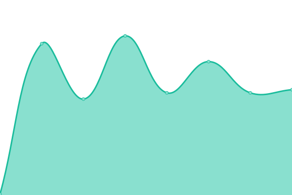
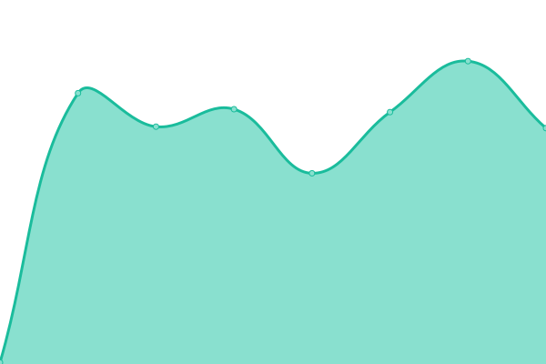
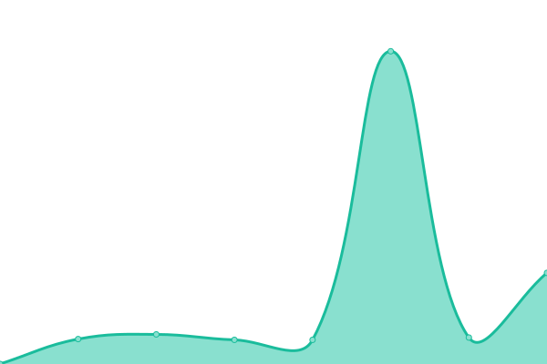
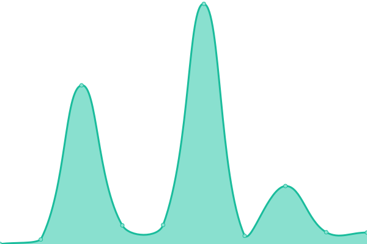

# [📈 Live Status](https://zeenkeystatus.ga): <!--live status--> **🟧 Partial outage**

This repository contains the open-source uptime monitor and status page for [ZEENKEY](https://www.zeenkey.com), powered by [Upptime](https://github.com/upptime/upptime).

With [Upptime](https://upptime.js.org), you can get your own unlimited and free uptime monitor and status page, powered entirely by a GitHub repository. We use [Issues](https://github.com/ZEENKEY/statuspage/issues) as incident reports, [Actions](https://github.com/ZEENKEY/statuspage/actions) as uptime monitors, and [Pages](https://zeenkeystatus.ga) for the status page.

<!--start: status pages-->
<!-- This summary is generated by Upptime (https://github.com/upptime/upptime) -->
<!-- Do not edit this manually, your changes will be overwritten -->
<!-- prettier-ignore -->
| URL | Status | History | Response Time | Uptime |
| --- | ------ | ------- | ------------- | ------ |
|  [Official Website](https://www.zeenkey.com) | 🟩 Up | [official-website.yml](https://github.com/ZEENKEY/statuspage/commits/HEAD/history/official-website.yml) | 

 280ms
     
 | 

<a href="https://zeenkeystatus.ga/history/official-website">92.61%</a>
    

|  [ZEENKEY BLOG](https://blog.zeenkey.com) | 🟩 Up | [zeenkey-blog.yml](https://github.com/ZEENKEY/statuspage/commits/HEAD/history/zeenkey-blog.yml) | 

 995ms
     
 | 

<a href="https://zeenkeystatus.ga/history/zeenkey-blog">92.60%</a>
    

|  [ZEENKEY Games](https://play.zeenkey.com) | 🟩 Up | [zeenkey-games.yml](https://github.com/ZEENKEY/statuspage/commits/HEAD/history/zeenkey-games.yml) | 

 185ms
     
 | 

<a href="https://zeenkeystatus.ga/history/zeenkey-games">100.00%</a>
    

|  [ZEENKEY CDN](https://zeenkeycdn.ga) | 🟥 Down | [zeenkey-cdn.yml](https://github.com/ZEENKEY/statuspage/commits/HEAD/history/zeenkey-cdn.yml) | 

 0ms
     
 | 

<a href="https://zeenkeystatus.ga/history/zeenkey-cdn">0.00%</a>
    

|  [Server 1](https://www.zeenkey.com) | 🟩 Up | [server-1.yml](https://github.com/ZEENKEY/statuspage/commits/HEAD/history/server-1.yml) | 

 186ms
     
 | 

<a href="https://zeenkeystatus.ga/history/server-1">91.92%</a>
    

|  [Status server](https://zeenkeystatus.ga) | 🟥 Down | [status-server.yml](https://github.com/ZEENKEY/statuspage/commits/HEAD/history/status-server.yml) | 

 0ms
     
 | 

<a href="https://zeenkeystatus.ga/history/status-server">0.00%</a>
    

<!--end: status pages-->

[**Visit our status website →**](https://zeenkeystatus.ga)

## 📄 License

- Powered by: [Upptime](https://github.com/upptime/upptime)
- Code: [MIT](./LICENSE) © [ZEENKEY](https://www.zeenkey.com)
- Data in the `./history` directory: [Open Database License](https://opendatacommons.org/licenses/odbl/1-0/)
